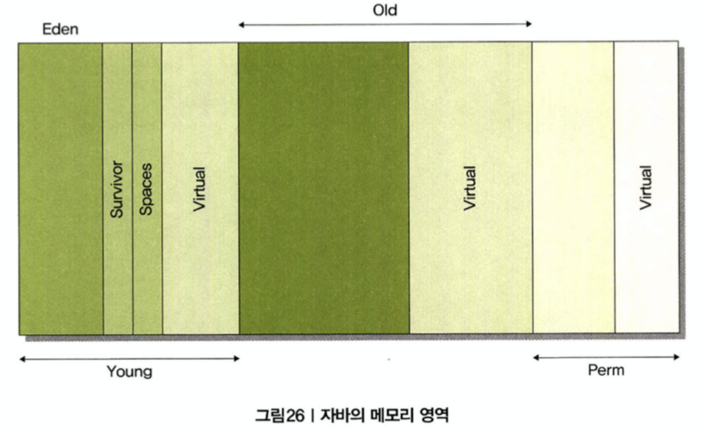
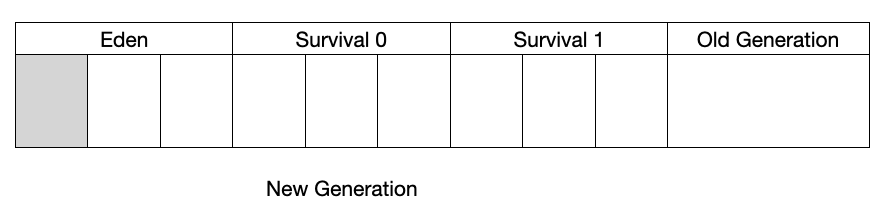
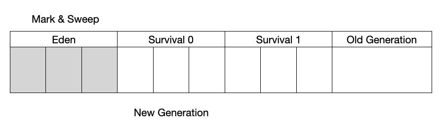
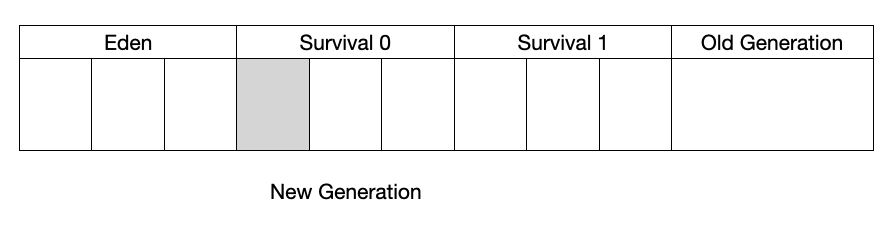
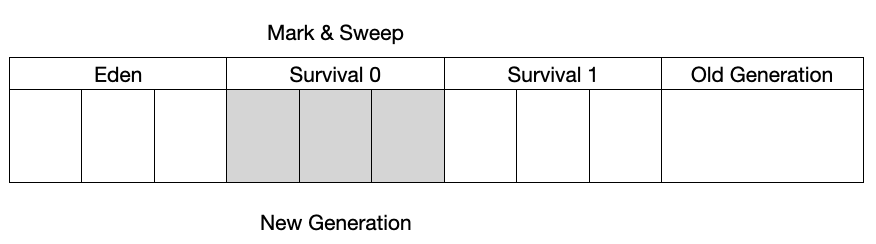
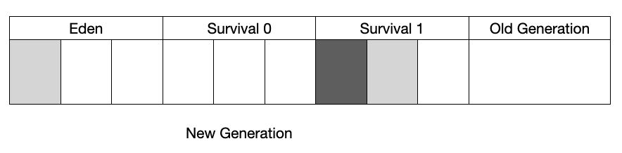
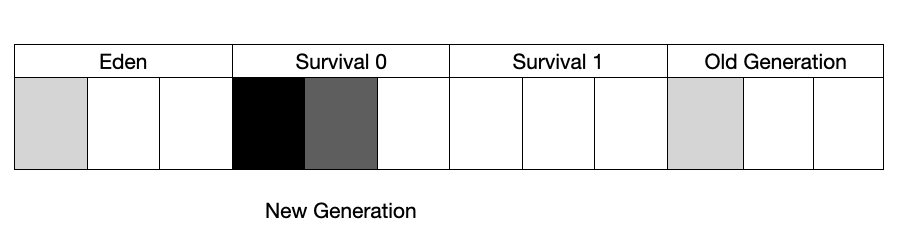
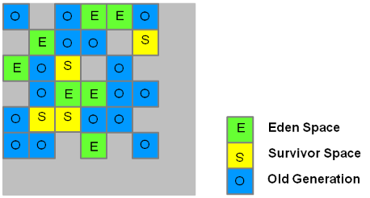

# 12. 도대체 GC는 언제 발생할까?

* 1. GC란?
* 2. 자바의 Runtime Data Area
* 3. GC의 원리
* 4. GC의 종류
* 5. 5가지 GC 방식
* 6. 강제 GC 시키기
* 7. 정리

---
## 1. GC란?

GC란 Garbage Collection의 약자로 말 그대로 쓰레기를 정리하는 작업입니다.  
하나의 객체는 메모리를 점유하고, 필요하지 않으면 메모리를 해제되어야 한다.  
 * 자바에서는 메모리를 GC라는 알고리즘을 통해서 관리하기 때문에, 개발자가 메모리를 처리하기 위한 로직이 필요없다.  

---
 ## 2. 자바의 Runtime Data Area

 자바에서 사용하는 메모리 영역은 아래와 같다.  
  * PC 레지스터
  * JVM 스택
  * 힙(Heap)
  * 메서드 영역
  * 런타임 상수 풀
  * 네이티브 메서드 스택


위에 영역중에서 GC가 발생하는 부분은 바로 힙 영역이다.  
즉, 나머지 영역은 GC의 대상이 아니다.
 * 클래스 로더 서브 시스템(Class Loader Subsystem): 클래스나 인터페이스를 JVM으로 로딩하는 기능 수행
 * 실행 엔진(Execution Engine): 로딩된 클래스의 메서드들에 포함되어 있는 모든 인스트럭션 정보를 실행

### Heap 메모리

클래스 인스턴스, 배열이 이 메모리에 쌓인다.  
이 메모리는 '공유 메모리'라고도 불리며 여러 쓰레드에서 공유하는 데이터들이 저장되는 메모리다.  

### Non-Heap 메모리

 * 메서드 영역
 * * 메서드 영역은 모든 JVM 쓰레드에서 공유된다.
 * JVM 스택
 * * 쓰레드가 시작할 때 JVM 스택이 생성된다. 이 스택에는 메소드가 호출되는 정보인 프레임이 저장된다. 그리고, 지역 변수와 임시 결과, 메소드 수행과 리턴에 관련된 정보들도 포함된다.
 * PC 레지스터
 * * 자바의 쓰레드들은 각자의 PC 레지스터를 갖는다. 네이티브한 코드를 제외한 모든 자바 코드들이 수행될 때 JVM의 인스트럭션 주소를 PC 레지스터에 보관한다.

---
## 3. GC의 원리

### 가비지 콜렉터(Garbage Collector)

GC 작업을 하는 가비지 콜렉터는 다음의 역할을 한다.
 * 메모리 할당
 * 사용 중인 메모리 인식
 * 사용하지 않는 메모리 인식

### 자바의 메모리 영역



자바의 메모리 영역은 크게 Young, Old, Perm 세 영역으로 나뉜다.  
 * Perm 영역은 JDK 8부터 사라지고, Virtual 영역은 가상 영역으로 고려하지 않는다.
 * 해당 영역을 제외하면 Young 영역(Eden 영역 + 2개의 Survivor)과 Old 영역이 남는다.
 * 즉, 고려해야 할 자바의 메모리 영역은 총 4개의 여역으로 나뉜다고 볼 수 있다.


### 1. 메모리에 객체가 생성되면, Eden 영역에 객체가 지정된다.


### 2. Eden 영역에 데이터가 꽉 차면, 이 영역에 있던 객체가 어디론가 옮겨지거나 삭제 되어야 한다.


### 3. 이때 옮겨가는 위치가 Survivor 영역이다. 두 개의 Survivor 영역 사이에 우선순위는 존재하지 않는다. 또한, 두 영역 중 한 영역은 반드시 비어 있어야 한다. 그 비어있는 영역에 Eden 영역에 있던 객체 중 GC 후에 살아 남는 객체들이 이동한다.


### 4. 할당된 Survivor 영역이 차면, GC가 되면서 Eden 영역에 있는 객체와 꽉 찬 Survivor 영역에 있는 객체가 비어있는 Survivor 영역으로 이동한다. 이러한 작업을 반복하면서 Survivor 1과 2를 왔다 갔다 하던 객체들은 Old 영역으로 이동한다.




 * Eden 영역과 Survivor 영역 정리
 * * Eden 영역: 객체가 최초로 생성되는 영역으로 새로 생성된 객체는 Eden 영역에 할당된다.
 * * Survivor 영역: Eden 영역에서 일정 시간 동안 살아남은 객체들이 복사되는 임시 공간
 * * * Survivor 영역은 주로 Minor GC(젊은 세대 가비지 컬렉션) 작업에서 사용되며, Eden 영역에서 복사되고 살아남은 객체들이 임시로 유지되는 공간이다. 이러한 복사와 이동을 통해, Eden 영역에서의 가비지 컬렉션을 비교적 빠르고 효율적으로 처리할 수 있습니다.

---
## 4. GC의 종류

GC는 크게 두 가지 타입으로 나뉜다.
 * 마이너 GC: Young 영역에서 발생하는 GC
 * 메이저 GC: Old 영역이나 Perm 영역에서 발생하는 GC

---
## 5. 5가지 GC 방식

JDK 7 이상에서는 다섯 가지 GC 방식을 지원한다.

### 5-1. 시리얼 콜렉터

Young 영역와 Old 영역이 시리얼하게(연속적으로) 처리되며 하나의 CPU를 사용한다.  
Sun에서는 이 처리를 수행할 때를 Stop-the-world라고 표현한다.  
다시 말하면 콜렉션이 수행될 때 애플리케이션 수행이 정지된다.  
 * 가비지 컬렉션 작업이 실행되는 동안에는 애플리케이션의 모든 스레드가 일시적으로 정지되며, 가비지 컬렉션 작업이 완료될 때까지 애플리케이션이 일시적으로 멈추게 됩니다.
 * Old 영역이나 Perm 영역에 있는 객체들의 GC는 Mark-sweep-compact 콜렉션 알고리즘을 따른다.

### 5-2. 병렬 콜렉터

이 방식은 스루풋 콜렉터(throughput collector)로도 알려진 방식이다.  
이 방식의 목표는 다른 CPU가 대기 상태로 남아 있는 것을 최소화하는 것이다.  
시리얼 콜렉터와 달리 Young 영역에서의 콜렉션을 병렬(parallel)로 처리한다.  
많은 CPU를 사용하기 때문에 GC의 부하를 줄이고 애플리케이션의 처리량을 증가시킬 수 있다.  
 * Old 영역의 GC는 시리얼 콜렉터와 동일한 Mark-sweep-compact 콜렉션 알고리즘을 사용한다.

### 5-3. 병렬 콤팩팅 콜렉터

이 방식은 JDK 5.0 업데이트 6부터 사용 가능하다.  
병렬 콜렉터와 동일하게 여러 CPU를 사용하는 서버에 적합하다.  
병렬 콜렉터와 다른 점은 Old 영역 GC에서 새로운 알고리즘을 사용한다는 것이다.  

그러므로 Young 영역에 대한 GC는 병렬 콜렉터와 동일하지만, Old 영역의 GC는 다음의 3단계를 거친다.

 * 표시 단계 : 살아 있는 객체를 식별하여 표시해 놓는 단계
 * 종합 단계 : 이전에 GC를 수행하여 컴팩션된 영역에 살아 있는 객체의 위치를 조사하는 단계
 * 컴팩션 단계 : 컴팩션을 수행하는 단계. 수행 이후에는 컴팩션된 영역과 비어 있는 영역으로 나뉜다.

### 5-4. CMS 콜렉터

이 방식은 로우 레이턴시 콜렉터(low-latency collector)로도 알려져 있으며, 힙 메모리 영역의 크기가 클 때 적합하다.  
2개 이상의 프로세서를 사용하는 서버에 적합하다.  
Young 영역에 대한 GC는 병렬 콜렉터와 동일하다.  

Old 영역의 GC는 다음 단계를 거친다.

 * 초기 표시 단계 : 매우 짧은 대기 시간으로 살아 있는 객체를 찾는 단계.
 * 컨커런트 표시 단계 : 서버 수행과 동시에 살아 있는 객체에 표시를 해 놓는 단계.
 * 재표시(remark) 단계 : 컨커런트 표시 단계에서 표시하는 동안 변경된 객체에 대해서 다시 표시하는 단계.
 * 컨커런트 스윕 단계 : 표시되어 있는 쓰레기를 정리하는 단계.

### 5-5. G1 콜렉터

지금까지 설명한 모든 Garbage Collector는 Eden과 Survivor 영역으로 나뉘는 Young 영역과 Old 영역으로 구성되어 있다.  
하지만, Garbage First (이하 G1)는 지금까지의 Garbage Collector와는 다른 영역으로 구성되어 있다.  

G1은 Young 영역과 Old 영역이 물리적으로 나뉘어 있지 않고, 각 구역의 크기는 모두 동일하다.  
앞서 살펴본 콜렉터들은 모두 Young과 Old 영역의 주소가 물리적으로 Linear하게 나열되지만, G1은 그러지 않다.



 * G1 Young 영역 GC (마이너 GC)
 * * 1. 몇 개의 구역을 선정하여 Young 영역으로 지정한다.
 * * 2. 이 Linear하지 않은 구역에 객체가 생성되면서 데이터가 쌓인다.
 * * 3. Young 영역으로 할당된 구역에 데이터가 꽉 차면, GC를 수행한다.
 * * 4. GC를 수행하면서 살아있는 객체들만 Survivor 구역으로 이동한다.

 * G1 Old 영역 GC (메이저 GC)
 * * 초기 표시 단계(Initial Mark) 단계(STW) : Old 영역에 있는 객체에서 Survivor 영역의 객체를 참조하고 있는 객체들을 표시한다.
 * * 기본 구역 스캔(Root Region scanning) 단계 : Old 영역 참조를 위해서 Survivor 영역을 훑는다. 참고로 이 작업은 Young GC가 발생하기 전에 수행된다.
 * * 컨커런트 표시 단계 : 전체 힙 영역에 살아있는 객체를 찾는다. 만약 이 때 Young GC가 발생하면 잠시 멈춘다.
 * * 재표시(Remark) 단계(STW) : 힙에 살아있는 객체들의 표시 작업을 완료한다. 이 때 snapshot-at-the-begging (SATB)라는 알고리즘을 사용하며, 이는 CMS GC에서 사용하는 방식보다 빠르다.
 * * 청소(Cleaning) 단계(STW) : 살아있는 객체와 비어 있는 구역을 식별하고, 필요없는 객체들을 지운다. 그리고 나서 비어 있는 구역을 초기화한다.
 * * 복사 단계(STW) : 살아 있는 객체들을 비어 있는 구역으로 모은다.

 * G1 콜렉터 정리
 * * G1은 CMS GC의 단점을 보완하기 위해서 만들어 졌으며 GC 성능도 매우 빠르다.  
 * * G1 콜렉터는 대규모 메모리 힙에서 발생하는 긴 일시 중지 시간 문제를 완화하기 위해 고안되었다.
 * * 실제로 JDK 8 까지는 기본적으로 Parallel(병렬) 또는 CMS(Concurrent Mark Sweep) 가비지 컬렉터가 사용되었지만, JDK 9부터는 G1 콜렉터가 기본적으로 선택되어서 사용됩니다.

---
## 6. 강제 GC 시키기

System.gc() 메소드나 Runtime.getRuntime().gc() 메소드를 사용하여 강제로 GC를 발생시킬 수도 있다.  
 * 강제로 GC를 발생시킬 수 있지만, 실제로 코드에 절대로 사용하지 말 것을 권장한다.
 * 아래 예제 코드는 단순히 String 더하기 연산 10회를 반복하는 코드로 System.gc() 메소드를 사용하는지 안하는지에 따른 성능을 확인한다.
 * * GC 방식이 무엇이든 관계없이 GC를 수행하는 동안 애플리케이션의 성능에 영향을 미친다.

```Java
// System.gc() 포함: 750ms ~ 850ms
// System.gc()) 메소드 미포함: 0.13ms ~ 0.16ms
long startTime = System.nanoTime();
for(int outLoop = 0; outLoop < 10; outLoop++) {
    String aValue = "abcd..";
    for(int loop = 0; loop < 10; loop++) {
        aValue += aValue;
    }
    System.gc();
}
double time = (System.nanoTime() - startTime) / 1000000.000;
System.out.println(time);
```

---
## 7. 정리

CG 방식을 외우면서 개발하거나 서버를 설정할 필요는 없다.  
단순히 어느 정도 이해하고, 필요할 때 알맞은 CG 방식을 시스템에 적용하는 정도가 바람직하다.  

---
## 참고하면 좋은 사이트

* G1 Collector 공식 문서: https://www.oracle.com/technetwork/tutorials/tutorials-1876574.html
